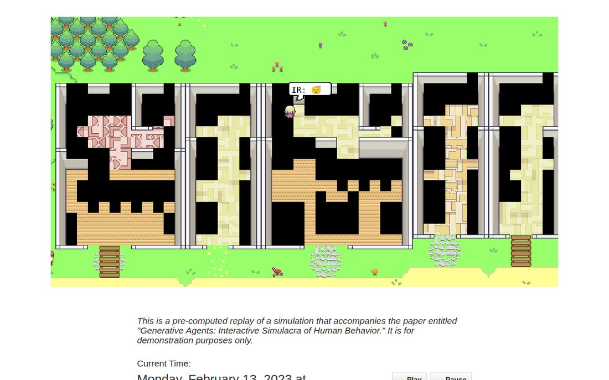
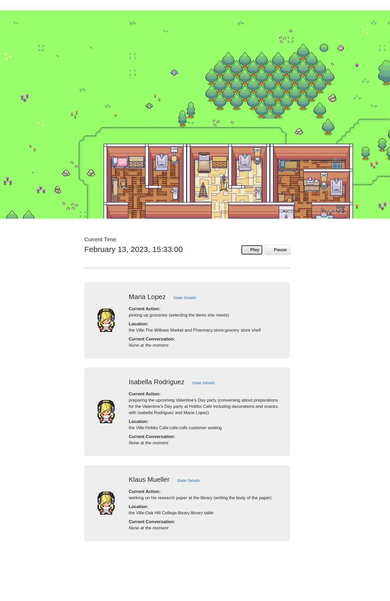
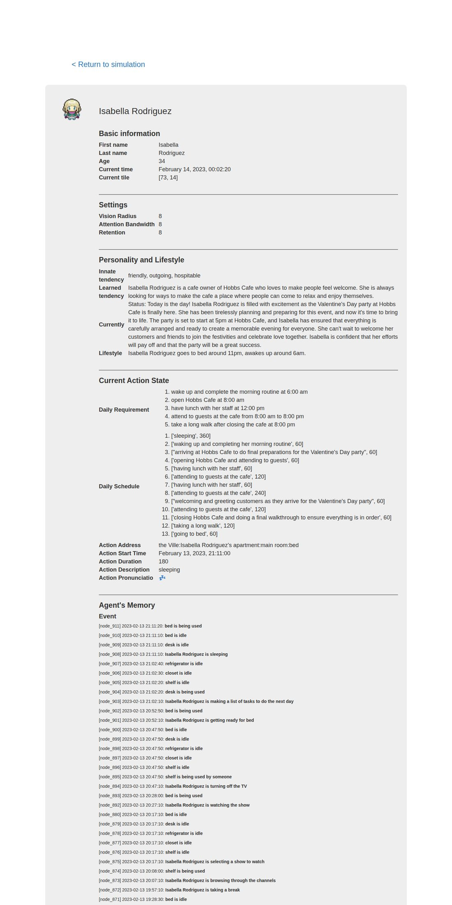
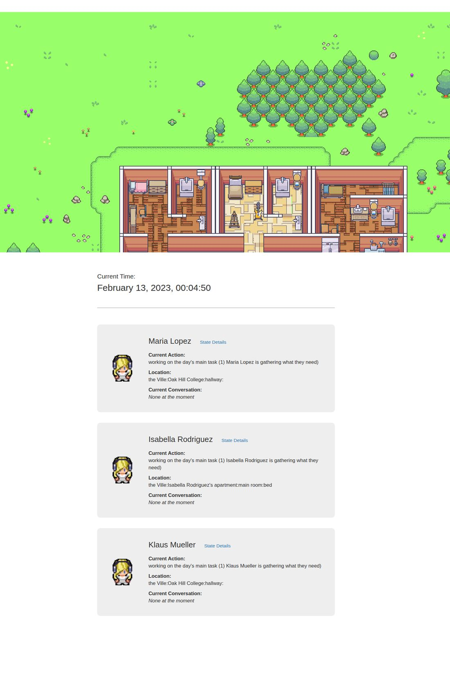
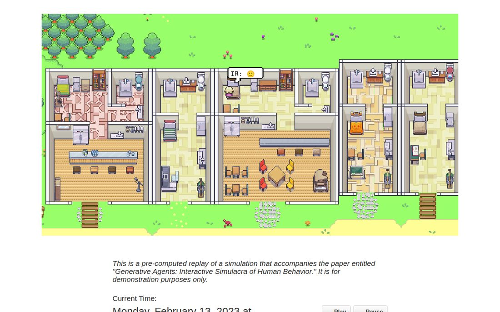
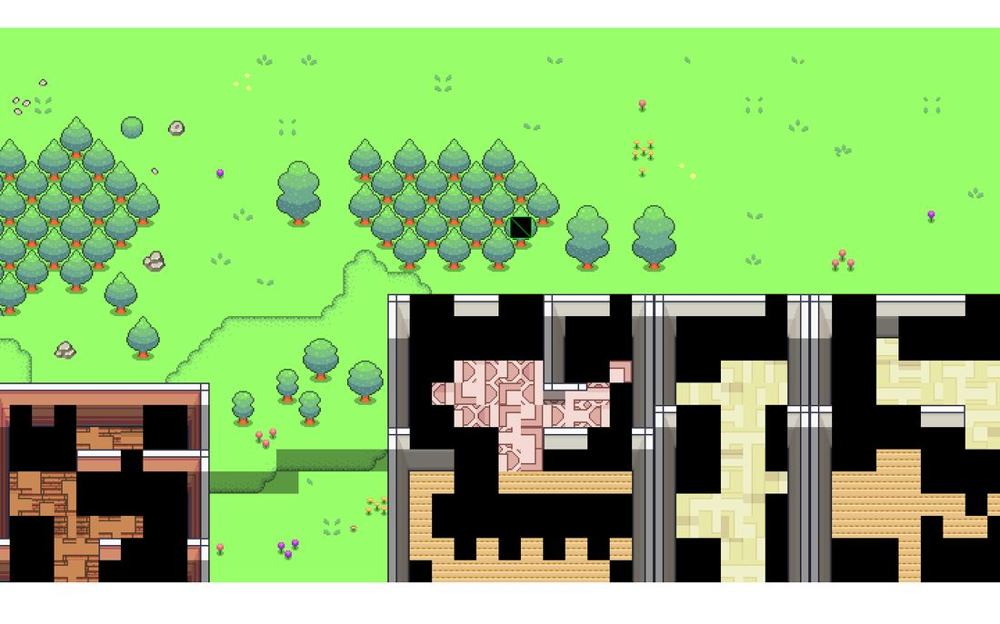

# Generative Agents (Smallville) — hands-on test report (2026-09-30)

A first-time user's session: following the README, visiting every page, replaying the paper's
simulation, running a **new** simulation end to end, interviewing an agent, saving, resuming, and
publishing the result as a demo. Every step was done by hand in a browser and terminal, with
screenshots; anything that broke was traced to the code.

**Tested revision:** `fe05a71d` · Python 3.11.15 · Django 2.2.28 · headless Chromium 1194 · Linux
container · **Tester:** Claude (Claude Code), on behalf of the repo owner.

---

## 1. Summary

**What works:** the environment server, replaying and demoing the paper's pre-computed run (the
Valentine's Day party story is all there), and the whole simulation lifecycle: fork a base sim →
`run N` with the browser in the loop → inspection commands → interview an agent → `fin` (save) →
replay your own run → compress → demo → fork the saved run and resume.

**What stops a new user today:**

1. **It can't reach a model as shipped.** It calls `text-davinci-003` (retired by OpenAI in January
   2024) through the `openai==0.27` client (G9).
2. **The first `run` on a fresh clone crashes**: the base sims have no `movement/` folder (G3).
3. **Replay and the live simulator freeze** if a third-party tutorial site that hosts the character
   atlas is unreachable (G2).
4. **Building interiors render black** on GPUs with an 8,192 px texture limit (many laptops and
   phones, software renderers), because four tilesets are over 10,000 px tall (G1).
5. **Unvalidated model output crashes the run**, including the code's own fail-safe
   (`"kitchen"`), and it crashes interview mode (G4, G6).

## 2. How the model was provided (read this first)

No model provider was reachable from the test container, and no API key was available. One
simulation step for 3 agents makes many model calls: my 150-step run (25 simulated minutes) made
**about 600 completions plus about 100 embeddings**. Answering those by hand wasn't feasible, so the
backend was pointed (`OPENAI_API_BASE`) at a **scripted stand-in** ([`ga_standin.py`](ga_standin.py)).
It returns well-formed, template-shaped answers and deterministic pseudo-embeddings. **It is not an
AI.** The agents in my runs behave in canned ways ("working on the day's main task" at midnight).
Everything below tests the software, not the quality of agent behaviour.

## 3. Setup notes

* Python 3.11 instead of the README's 3.9.12. The full `requirements.txt` pins (numpy 1.25.2,
  Pillow 8.4, gensim 3.8, …) target 3.9. What was actually needed:
  * Frontend: `Django==2.2.28 django-cors-headers==3.2.1 django-storages==1.9.1 numpy`
  * Backend: `openai==0.27.0 numpy scikit-learn selenium`
* `utils.py` created exactly as the README says (it's gitignored, which is good).
* Phaser, jQuery and Bootstrap load from CDNs. Those hosts are blocked here, so the test browser
  served the same versions from npm.
* Running the app **modifies tracked files** (`temp_storage/curr_sim_code.json`,
  `temp_storage/path_tester_env.json`), so the git tree is dirty after any use.

## 4. Walkthrough

### 4.1 The web pages

* `/`: "Your environment server is up and running!" ✔
* `/simulator_home` without a backend: a clear "Please start the backend first." ✔
* **Every page** logs `Bootstrap's JavaScript requires jQuery`: `templates/base.html:23-24` loads
  `bootstrap.min.js` before jQuery. `jquery-latest.min.js` has been frozen at 1.11.1 since 2014 (G7).

### 4.2 Demo of the paper's run: black interiors (G1)

| Default (WebGL) | Forced Canvas renderer |
|---|---|
|  |  |

The console shows `WebGL: INVALID_VALUE: texImage2D: width or height out of range` ×4. The cause is
in `static_dirs/assets/the_ville/visuals/map_assets/v1/`:

| file | size |
|---|---|
| interiors_pt1.png | 512 × 10016 |
| interiors_pt2.png | 512 × 10016 |
| interiors_pt3.png | 512 × 10032 (also not a multiple of 32 → "Image tile area not tile size multiple") |
| interiors_pt5.png | 512 × 9024 |

The test browser's `MAX_TEXTURE_SIZE` is 8192. Forcing Phaser's Canvas renderer draws every
interior correctly (right-hand image). **Fix:** use `type: Phaser.CANVAS`, or split those tilesets
into images no taller than 8192 px.

### 4.3 Replay (G2, G8)

The replay froze on its first step: `game.loop.frame` stopped advancing, followed by `Cannot read
properties of undefined (reading 'duration')`. `templates/home/main_script.html:180-182` (also used
by the live simulator and path tester) loads the character atlas from
`https://mikewesthad.github.io/phaser-3-tilemap-blog-posts/post-1/assets/atlas/…`, a Phaser
**tutorial's** assets. With that site unreachable, the walk animations don't exist and the game loop
crashes. The demo page already uses local sprites plus `static_dirs/assets/characters/atlas.json`;
the home template should too. (To keep testing, my test browser served the local sprite with the
frame names translated. The repo was not changed.)

With that shim, replay works well: you can watch the party planning, and each agent card shows
action, location and conversation.



* **State Details ignores the time you're viewing** (G8). Opened at 15:33 (step 5510), it shows the
  final state (current time "Feb 14 00:02", memories up to 21:11). `replay_persona_state` always
  loads the final `bootstrap_memory`; the step in the URL is unused.
  
* A quirk in the recorded data: at 15:33 Isabella is "conversing … with Isabella Rodriguez and Maria
  Lopez" while Maria is at the market.

### 4.4 Running a new simulation

`python reverie.py` → fork `base_the_ville_isabella_maria_klaus` → `claude-smallville-1` →
open `/simulator_home` → `run 30`.

1. **Crash:** `KeyError: 'kitchen'` in `spatial_memory.get_str_accessible_arena_game_objects`. The
   stand-in gave an unusable room answer, and **the code's own fail-safe arena is `"kitchen"`**
   (`run_gpt_prompt.py:569, 699`). Isabella's apartment only has "main room", so the fail-safe
   itself crashes and the whole `run` aborts (G4). Model answers for sector/arena/object are also
   used without checking that they exist in spatial memory.
2. **Crash:** `FileNotFoundError: …/claude-smallville-1/movement/0.json`. Git doesn't store empty
   folders, so neither base simulation has `movement/`, and every fresh clone hits this on the
   first run (G3). `mkdir movement` fixes it.
3. After that: `run 30` → `run 120` completed. 150 steps; the browser and backend exchanged state
   every step.



**Terminal commands tried:**

| command | result |
|---|---|
| `print current time` | ✔ `February 13, 2023, 00:25:00 · steps: 150` |
| `print persona schedule Isabella Rodriguez` | ✔ |
| `print persona current tile Klaus Mueller` | ✔ `(120, 31)` |
| `print tile event 73, 14` | ✔ |
| `print persona spatial memory Klaus Mueller` | ✔ full location tree |
| `print persona associative memory (chat) Maria Lopez` | ✘ `AttributeError: 'str' object has no attribute 'content'` (`associative_memory.py:298`) (G5) |
| an unknown command | silently ignored, no message |
| `call -- analysis Isabella Rodriguez` (interview) | ✘ first time: `int('okay')` on the safety score (`converse.py:267`), no fallback (G6). ✔ once the stand-in returned a number: the interview retrieves Isabella's memories, summarises them and answers in character |
| `end_convo`, `fin` | ✔ saved; `reverie/meta.json` records step 150 |
| `exit` (in an earlier, unsaved sim) | ✔ quits and deletes the unsaved sim, as documented |

* **Junk output becomes memory** (G10). The stand-in answered "okay" to "Would Maria initiate a
  conversation with Klaus?". That was treated as a yes, the fail-safe produced a dialogue of `"..."`
  lines, and it was stored as a real conversation.

### 4.5 Publishing my run

* `/replay/claude-smallville-1/1/` ✔ (138 steps in 8 s) · State Details ✔
* `compress('claude-smallville-1')`: 1.7 MB → 552 KB. The script has no command-line argument; the
  sim name is hard-coded in `__main__`, so you have to edit the file (as the README says).
* `/demo/claude-smallville-1/1/3/` ✔ proper per-character sprites and full interiors (Canvas).
  The page always says it's "a pre-computed replay … that accompanies the paper", even for your own
  runs.



* **Resume:** forked `claude-smallville-1` → `claude-smallville-2`, `run 10`: continued from step
  150 → 160 ✔.

### 4.6 Path tester

Works, but it uses the same external atlas (missing player sprite here) and POSTs
`/path_tester_update/` about 6 times a second, rewriting `temp_storage/path_tester_env.json` each
time.



## 5. Bugs

| ID | Sev | Bug | Where |
|---|---|---|---|
| G9 | H | Uses retired `text-davinci-003` + `openai==0.27`; can't run with a real OpenAI key today | `persona/prompt_template/gpt_structure.py`, `run_gpt_prompt.py` |
| G3 | H | Base sims lack `movement/`; the first `run` on a fresh clone crashes | `storage/base_*`, `reverie.py` (write without mkdir) |
| G2 | H | Replay, simulator and path tester load the character atlas from a third-party tutorial site; if it's unreachable the game loop crashes | `templates/home/main_script.html:180-182`, `path_tester/main_script.html:136-137` |
| G1 | H | Interiors render black when `MAX_TEXTURE_SIZE` is 8192: tilesets are 9024–10032 px tall | `map_assets/v1/interiors_pt{1,2,3,5}.png` |
| G4 | H | Fail-safe arena `"kitchen"` (and unvalidated model locations) → `KeyError`, run aborted | `run_gpt_prompt.py:569,699`, `plan.py:221`, `spatial_memory.py:107` |
| G6 | M | Interview mode crashes on any non-integer safety score | `converse.py:267` |
| G5 | M | `print persona associative memory (chat)` crashes | `associative_memory.py:298` |
| G8 | M | Persona State Details ignores the requested step | `translator/views.py` `replay_persona_state` |
| G10 | M | Non-committal/junk model answers become stored conversations/memories | `converse.py` / fail-safes |
| G7 | L | Bootstrap JS loaded before jQuery; `jquery-latest` frozen at 1.11.1 | `templates/base.html:23-24` |
| — | L | Unknown terminal command silently ignored | `reverie.py` |
| — | L | `compress_sim_storage.py` has no command-line argument | `reverie/compress_sim_storage.py` |
| — | L | Path tester writes to disk ~6×/s | `path_tester_update` |
| — | L | Running the app dirties tracked `temp_storage/*.json` | `temp_storage/` |
| — | L | Demo text always claims the run accompanies the paper | `templates/demo/demo.html` |

## 6. Suggested fixes (small)

1. Add `storage/base_*/movement/.gitkeep`, or `os.makedirs(..., exist_ok=True)` before writing
   movement files.
2. In `home/main_script.html` and `path_tester/main_script.html`, load the local sprites and
   `atlas.json` like `demo/main_script.html` does.
3. Set `type: Phaser.CANVAS`, or re-slice `interiors_pt*` into tiles of 8192 px or less.
4. Validate arena/sector/object choices against spatial memory; make the fail-safe the first valid
   option instead of `"kitchen"`.
5. Wrap `int(...)` of model output in `try/except` with a sensible default.
6. Move to the current OpenAI client and a supported chat model; embeddings to
   `text-embedding-3-small`.
7. Swap the two script tags in `base.html`; pin jQuery 3.x.

## 7. Reproducing this test

```bash
# frontend
pip install Django==2.2.28 django-cors-headers==3.2.1 django-storages==1.9.1 numpy
cd environment/frontend_server && python manage.py runserver
# backend (another shell); create utils.py per README
pip install openai==0.27.0 numpy scikit-learn selenium
python docs/hands-on-test-2026-09-30/ga_standin.py /tmp/standin.log &   # scripted stand-in on :7788
cd reverie/backend_server && OPENAI_API_BASE=http://127.0.0.1:7788/v1 python reverie.py
#   base_the_ville_isabella_maria_klaus → my-sim → (mkdir the movement/ folder) → run 30 → fin
```
